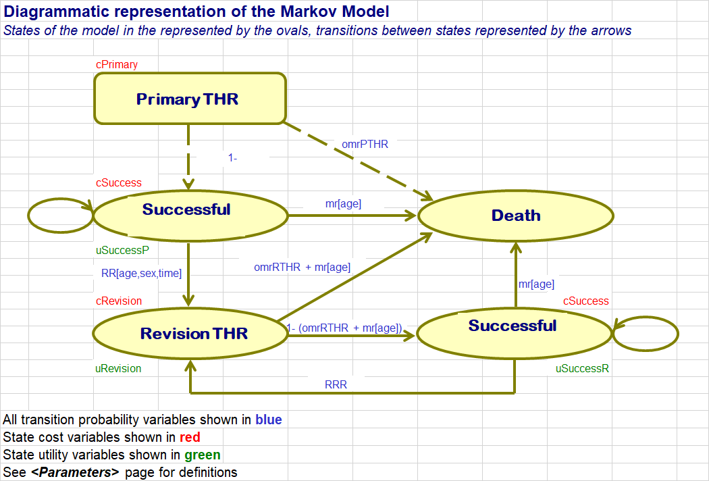

```{r setup, include=FALSE}
knitr::opts_chunk$set(echo = TRUE)
```

## Overview 

In this exercise we will build a Markov model in R. Of particular interest is the use of time dependent transition functions to represent probabilities.  The exercise will get you to construct two types of time varying transition probabilities: (i) time-varying transitions from a life-table, and (ii) time-varying transitions estimated from a parametric survival model.

In this exercise we will be focusing on:

1. Preparing parameters 
2. Parametric time-dependent transitions from a survival analysis
3. Life-table transitions for background mortality
4. Building a Markov model for the standard prosthesis
5. Adapting the model for a new prosthesis
6. Estimating cost-effectiveness (deterministically)


Before beginning the exercise take a moment to familiarise yourself with the R template for the exercise, ‘A1.3.1_Advanced_Markov_Modelling_Template.R' and the figure below. Figure A1.3.1a contains the overall structure of the model you are about to build and it will be worth you spending a little time familiarising yourself with this figure.  It contains state transition diagram of the four-state Markov model you will be building and contains a key to the different parameters of the model, which are seperated into three categories: transition probabilities, state costs and state utilities.  
The model itself is constructed across a number of sections with separate sections for the parameters of the model and the final analysis, for the survival analysis used to estimate prosthesis failure rates, for each of the Markov model arms and for the life tables used for mortality rates.  Of course, there are many ways to structure models – much being down to personal preference.  However, we hope that you will find that our chosen way of presenting the model does not deviate too much from your own preferences!

**Figure A1.3.1a** 


## Step by step guide  

Open the corresponding template file and start at the <Parameters> section of the script. 

You will see that there are parameters that need to be defined. We will use 3 useful packages for data manipulation - datatable, tidyr, and dplyr. You can have a look on the internet (e.g. via Google) for more information on these.

The following cheat sheets are also available:
1) For data.table: 
https://s3.amazonaws.com/assets.datacamp.com/img/blog/data+table+cheat+sheet.pdf 
2) For tidyr and dplyr:
https://www.rstudio.com/wp-content/uploads/2015/02/data-wrangling-cheatsheet.pdf 

\  

(@) **Preparing parameters** 

The aim of this section of the exercise is to prepare the <Parameters> section to facilitate the use of parameter names throughout the rest of the modelling exercise.  

On opening the section you will see that some of the work has been done for you, including entry of patient characteristics, the inclusion of standard discounting rates, and the cost of the two prostheses that we are seeking to evaluate.  This section will guide you through the completion of the parameter information for the (constant) transition probabilities (taken from the model figure), the state costs and the state utilities.

i) We will start with the three transition probabilities that will be assumed to be constant in the model: the operative mortality rates and the re-revision rate parameters, which are named as “`tp.`” variables. We will assume that the operative mortality is 2% for both primary and revision procedures and that the re-revision rate is 4% per annum.  Enter these values now.

ii) Now we deal with the costs in the model.  Note that the costs of the prostheses (standard and new) have already been entered for you.  That leaves the costs for the states of the model.  However, the state cost for the primary procedure is assumed to be the same irrespective of the implant – we therefore leave this out (since it is received by both arms and nets out of the analysis, but would be important if you were interested in total costs for each arm).  We also assume for the purposes of this model that there is no ongoing cost to the health service if people have a successful implant in place.  Therefore the only cost to consider at this point is the cost of the revision procedure itself.  This has been estimated as £5,294 and this should be entered into `c.revision`. Afterwards, create a vector (`state.costs`) that combines all of these costs, remember that the order is important and should match the order of states that you will use in the state transition matrix [this order should match the order of states listed in `state.names`]

iii) Create two effect vectors; one for the life year effects of each health state and one for quality-adjusted life years. The quality of life utilities of a year spent in each of the model health states has been estimated to be 0.85, 0.75 and 0.30 for the Successful primary, Successful revision and Revision states respectively.  Enter these values into the respective “`u.`” variables. Pull this information together by creating a utility vector (remember this should match the same state order for costs as previously defined).

\  

(@) **Parametric time-dependent transitions from a survival analysis**  

If you go to the <Hazard function & Associated Parameters> section you will see the  importing of an output of a regression analysis on prosthesis failure. After importing the csv file `hazardfunction.csv` type in `View()` into the console to see the hazard ratios.  A parametric Weibull model was fitted to patient level survival time data to estimate this function.  The regression model shows that prosthesis survival time is significantly related to age, sex, and type of prosthesis (new versus standard).  In addition, the significance of the gamma parameter indicates that there is an important time dependency to the risk of failure – which increases over time.

Note that the estimation of this regression model was undertaken on the log hazard scale.  We therefore have to exponentiate the results to get the actual hazard rate.  The exponents of the individual coefficients are interpreted as hazard ratios (column “coefficient” in hazards data.frame).  For example, the new prosthesis has a hazard ratio of 0.26 indicating that it has a much lower hazard compared to the standard prosthesis.

Take a moment to understand this survival model.  If you are having trouble with the appropriate interpretation then do ask a tutor - we are about to implement this model and you may struggle if you are not clear on the interpretation from the start.

i) To start with, generate a link from the <Parameters> section  to the corresponding results of the survival analysis on the “hazards” data.frame for the constant, age and male coefficients. Fill in the remaining “`r.`” variable definitions. Remember that these values are on the log hazard scale.


ii) We now want to calculate the lambda value of Weibull distribution (this, together with the gamma parameter, enables us to specify the baseline hazard). In estimating a standard survival analysis, it is the log of the lambda parameter that is a linear sum of the coefficients multiplied by the explanatory variables.  Therefore to get the value of log lambda, multiply the coefficients of age and sex by the age and sex characteristics and add together, not forgetting to also add the constant term.  Remember that the parameters in “hazards” are on the log scale.  Exponentiate each of these to give the value of the lambda and gamma parameters of the Weibull distribution and the hazard ratio for the new prosthesis compared to the standard.


iii) Exponentiate the NP1 coefficient to get the Relative risk of revision for new prosthesis 1 compared to standard 

\  

(@) **Life-table transitions for background mortality** 

We can still employ time dependent transitions in other model states providing the time dependency relates to time in the model rather than time in the state itself.  This is the case for a background mortality rate, for example, which depends on the age of a subject rather than which state of the model they are in.  In this section we will illustrate the use of a time dependent transition to model background mortality in the model from a life-table.

Go to the <Life tables> section and familiarise yourself with the contents.  View the imported lifetable data.frame, containing figures on age-sex specific mortality rates taken from a standard life-table, published as deaths per thousand per year.  These are converted to the corresponding annual probabilities.  Notice the addition of an `Index` column – the reason for this will become apparent.

i) Create a vector (current.age) which combines the initial age of the cohort and their ages throughout the model

ii) Using the data.table package function `roll()` we can create, we have done this for you, but take a look at the functions used and the `death.risk` data.table created to understand the process. You can find more information on the data.table package in the package manual: https://cran.r-project.org/web/packages/data.table/data.table.pdf

(@) **Building a Markov model for the standard prosthesis** 

In preparation for building the Markov model we are going to specify the time dependent transition probability for prosthesis failure.  Recall from Section 3.1.2 that the cumulative hazard rate for the Weibull is given by:

$$ H(t) = \lambda t^{y}$$

and that the time dependent transition probability (for a yearly cycle length and time measured in years) is given by:

$$ tp(t) = 1 - exp \{H (t-1) - H(t)\} $$

$$ tp(t) = 1 - exp \{\lambda (t-1)^{\gamma} - \lambda t^{\gamma}\} $$

$$ tp(t) = 1 - exp \{\lambda [(t-1)^{\gamma} - t^{\gamma}]\} $$

i) Go to the <Standard> section. Use the above formula to calculate the time-dependent transition probability for the standard prosthesis (referred to in the script as `revision.risk`) using the cycle number for the time variable (`cycle`) and the lambda and gamma parameters already defined in this exercise. Do the same for the NP1 treatment arm.

ii) Now combine age and sex dependent risk of death (from `death.risk`), and age dependent risk of revision (which we have just defined for SP0 and NP1), into one data.table. Based on the column numbers we set a column key which switches between pulling risk of death from the “Men” or “Women” values. 

What you have just implemented is a relatively sophisticated use of survival analysis to model a time dependent transition within a Markov model.  Note that it only works because we will be using this time dependent transition from the initial state of the model – i.e. we know exactly how long subjects have spent in the initial model state.  Take a moment to make sure you understand what you have just implemented and the limitations on its use in a Markov framework.

You have now implemented all three key types of transition probability: constant, time dependent (function) and  time dependent (tabular).

Having specified the time dependent transition parameters on we can now proceed to construct the Markov model proper. To begin with we need to create an array of time dependent state transition matrices. 

i) Start by creating an empty array of an empty array of dimensions (number of states, number of states, number of cycles) [Hint: putting 0s instead of NAs allows for 0 values to be pre-filled for where transitions can’t occur]. It is recommended to provide dimension names (where the transition matrix column and row names match state names).

ii) Create a for loop that for cycle 1 to cycle 60 creates the correct transition matrix for each corresponding cycle. Refamiliarise yourself with the diagram of the model to highlight which transitions need to be filled. 

We then are concerned with generating the Markov trace: that is showing the numbers of patients that are in any one state at any one time. 

i) First create the first cycle trace by multiplying the seed population (cycle0) by the transition matrix for cycle1

ii) Create a for loop for cycle 2 to cycle 60 that multiplies populations within cycles with the correct transition matrix [Hint: you will have to “look back” if starting from cycle2]

iii) Take a look at the trace that you’ve constructed, provide a check (for example, check the sum across rows must always equal the size of the original cohort).

Now that we have the Markov trace we can calculate the cost and effects for each cycle of the model.

i) Calculate the life years for the standard treatment arm using the trace outputs and the life year vector.  By doing this without quality adjustment or discounting, this column can be used to calculate life-expectancy (which is often useful – but not particularly in this example). [Hint: `%*%` is a useful matrix multiplier]

ii) Now calculate quality adjusted life years (QALYs).  However, this is undiscounted.  Therefore, we need to apply the standard discount formula, you can do this by creating a matrix (discount.factor.o) which specifies the discount factor that needs to be applied for each cycle. Then multiply discount.factor.o with undisc.QALYs.SP0 to get the discounted QALYs for the standard treatment arm. 

iii) Calculate the costs in a similar manner (but this time with the state cost vector).  Don’t forget to incorporate the cost discount rate (which is different to the outcome discount rate).

iv) We want to include the cost of the original prosthesis, there are many ways to do this, but since it is a one off cost occurring in `cycle0`, here we can add on at the end.

v) Finally, sum the columns to get the per patient predictions of cost, life expectancy and QALYs for this arm of the model.  

Now perform the same processes for the NP1 treatment arm within the <NP1> section, then create an output matrix storing the differences in treatment costs and effects, and incremental cost-effectiveness ratio in the <Analysis> section. 

Congratulations! Your Markov model is now complete.  

Try re-running the model for a different sex and age groups (between 40 and 90 years), and/or different discount rates, and see differences in the results produced. 


