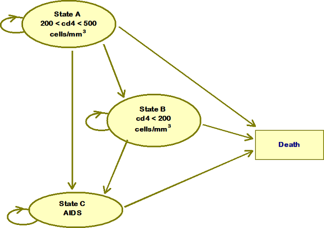

```{r, include=FALSE}
source("F3.3.3_Markov_Modelling_Solutions.R", local = knitr::knit_global())
```

## Overview 

The aim of this exercise is to get you to replicate a previously published Markov model by Chancellor and colleagues (1997). The model itself is somewhat out of date in that it compares combination therapy (lamivudine and AZT) to monotherapy (AZT alone).  Nevertheless, the model is straightforward enough to serve as a simple example that it is possible to replicate in a short period of time.

The basic structure of the model is given in the figure below, which shows that the chronic disease process is structured as  such that patients can move to successively more serious disease states, but cannot recover.

\  



The cycle length of the model is one year and the model is evaluated over 20 years (after which more than 95% of patients are expected to have died).

In this exercise you will use the data given below to populate the model and calculate the incremental cost-effectiveness ratio (ICER) for AZT monotherapy. Ultimately, you should be able to calcualte an ICER of £9,791 per LY gained.


**1. Transition probabilities**

The transitions in the table below were calculated from the counts of individuals that were observed to move between the four health states each year in a longitudinal data set from the Chelsea and Westminster hospital in London.  The counts are given in the table below. 

```{r, include =FALSE}
table <- matrix(data = c(1251, 350, 116, 17,
                         0, 731, 512, 15, 
                         0, 0, 1312, 437), 3, 4, byrow = TRUE)
dimnames(table) <- list(c("A", "B", "C"),c("A", "B", "C", "D"))
data.frame(table)
```

| Transition matrix | A  | B | C | D |
|:------|:-----|:--------|:------|:-----| 
|   A  |  1251  |  350  |    116  |  17 |
|  B   |  0      | 731 |    512  |  15 |
|    C |    0    |   0   |   1312 |  437 |
|    D |        |        |        |     |

**2. State costs**

The state costs are given in the code, and are based on an article reporting costs separately by state for ‘direct medical’ and ‘community care’ costs. The costs are shown here:
```{r, include =FALSE}
name <- c("Direct medical", "Community", "Total")
a <- c(c.dmca, c.ccca, c.dmca+c.ccca)
b <- c(c.dmcb, c.cccb, c.dmcb+c.cccb)
c <- c(c.dmcc, c.cccc, c.dmcc+c.cccc)
data.frame(name, a, b, c)
```

| Annual costs | State A  | State B | State C | 
|:------|:-----|:--------|:------|
|   Direct medical |  £1701   |  £1774  |    £6948  |
|  Community       |  £1055    | £1287   |    £2059  |
|    Total         |  £2756    | £3052   |   £9007  |


**3. Costs of Drugs**

The yearly cost of AZT monotheray is given as £2,278 and lamivudine is given as £2,086.50. 

**4. Treatment effect**

A meta-analysis of four trials is reported in the paper giving a pooled relative risk of disease progression as 0.509.  Note that this treatment effect is applied to all transition probabilities that represent disease progression.

**5. Discounting**

We will use the current discount rates in use in the UK – 3.5% for both costs and outcomes.  Note that the original analysis was based on discounting the costs at 6% but not discounting the estimates of life years – which gives an ICER of £6,276.

\newpage

## Step by step guide to constructing the model

Open the file ‘F3.3.2_Markov_Modelling_Template.R’. You will see that there are parameters that need to be defined, based on the data above.

i) Using the counts of transitions shown in the transitions probability section above, complete parameters definitions in the <Parameters> section for the transition probabilities.  Parameters starting with “`alpha.`” should contain the number of events of interest and “`sum.`” should contain the total transitions (the sum of events and complement), such that they should equal the appropriate row total from the transitions table above. Now calculate the respective transition probabilities in variables beginning with “`tp.`” using the “`alpha.`” and “`sum.`” variables. *(Note: For those on the advanced course, the reason for defining events and complements becomes apparent in later exercises using probabilistic methods)*  

ii) Enter the other information for the state costs (direct and community care costs), drug costs, treatment effect and discounting in the appropriate place in the script.

Having entered the input parameters of the model, the task now is to construct the Markov models for the treatment alternatives: combination and monotherapy. If you move to the <Markov Model> section, you will see that the number of model cycles are defined (`cycles <- 20 `), and the starting distribution of patients is set so that all patients start in State A (`seed <- c(1,0,0,0)`). 

First we will first create the transition matrix, and then create the structure for the Markov model, for each treatment alternative, starting with the monotherapy model.

(@) **Generating the Markov transition matrix**

The first step in building a Markov model is to define the transition matrix. This is a matrix that shows the probability of transition from states represented in the rows to states represented in the columns. A copy of the transition matrix is reproduced below for the monotherapy arm.

| Transition matrix | A  | B | C | D |
|:------|:-----|:--------|:------|:-----| 
|   A  |  tpA2A  |  tpA2B  |    tpA2C  |  tpA2D |
|  B   |  0      | tpB2B   |    tpB2C  |  tpB2D |
|    C |    0    |     0   |    tpC2C  |  tpC2D |
|    D |    0    |     0   |     0     |  tpD2D | 


Try building a transition matrix based on the transition parameters you’ve just defined in the above section. You can store a vector that represents the transitions out of each state first, before creating a matrix to add the data to. The first vector, named `A.AsympHIV.AZT`, represents transitions from State A, and this has been created for you. Now complete the remaining vectors and create the transition matrix.


Once you have completed the transition matrix, it should look like this:
```{r, echo = TRUE}
(tm.AZT)
```


(@) **Generating the Markov trace**

  We now need to generate the Markov trace: that is showing the proportions of patients that are in any one state at any one time.  Start by making sure that you understand the above transition matrix. In particular, make sure you can replicate it from the information given in the diagram of the model structure above.

i) First create an empty trace matrix of the right dimensions - we can call this `trace.AZT` (Line 98 in the template document). The data, number of rows, and number of columns have been left blank for you to add in. 

ii) Next, calculate the transitions for cycle1, by multiplying the transition matrix by the starting distribution of patients _(hint: use `%*%` for matrix multiplication in R for this)._

Your first cycle should now look like this:

```{r, echo = FALSE}
head(trace.AZT, 1)
```

iii) Now that you have calculated the first cycle, use the transition matrix to populate the rest of the Markov model by using a loop (we’ve started the outline of this for you).  This will involve looping through each row of the trace matrix and multiplying it with the transition matrix. _(Hint: to calculate the each row of results in the trace, use the row above to multiply with the transition matrix)._ Once this is done you can run the code to label each row, and check the trace to see check the numbers make sense. 

iv) Use the `rowSums()` function to provide a sense check, since the sum across columns for each row must always equal the size of the original cohort – which is set to 1 in this exercise, such that the Markov trace represents proportions of patients. _(Hint: if the numbers of patients in the model in each cycle is changing then there may be a mistake in the calculations done in the previous step)._ 

v) Check the printed version of the transition matrix to see the way people transition across the states over time. The first few cycle results should look like this:

```{r, echo=TRUE}
head(trace.AZT, 6)
```

By far the most tricky bit of building the basic Markov model in R is now complete.  Now that you have the Markov trace you can calculate the cost and effects.

(@) **Estimating Life Years**

i) Create a vector for life years (LY) for each state (each alive state should be associated with 1 life year, as the cycle length for this model is 1 year). 

ii) The reward vector (LY) can then be multiplied by the results in the trace matrix to estimate `ly.AZT`. _(Hint: again use %*% for matrix multiplication)._ 

iii) Use the `colSums()` function to estimate the total undiscounted life years from the AZT arm. However, since this is undiscounted, we need to apply the standard discount formula. You can do this by creating a matrix (`discount.factor.o`) which specifies the discount factor that needs to be applied for each cycle. Once you have run the code to create this, you can then  multiply the `discount.factor.o` with `ly.AZT` to get the discounted life years for the AZT treatment arm. _(Hint: use the same method as above for matrix multiplication)._ 

Once you have done this, you should have calculated total undiscounted LYs of __`r round(undisc.ly.AZT,4)`__ and discounted LY of __`r round(disc.ly.AZT,4)`__. 

(@) **Estimating costs**

Similarly to the life years, we can now calculate the costs. 

i) First, calculate the undiscounted costs for each time period by multiplying the appropriate cost vectror with the trace matrix. Note that there are multiple costs associated with states, including direct medical costs adn community costs, in addition to drug costs for AZT, that are given for the whole time period. *(Hint: You might want to consider adding performing a matrix multiplication for each cost, and then add these together for each cost item to estimate the total costs.)*  

ii) Similar to the above, create a discount factor matrix for costs and multiply this with the undiscounted costs for AZT. Again, store and print total costs for AZT, both undiscounted and discounted.

Once you have done this, you should have calculated total undiscounted costs of __£`r format(round(undisc.cost.AZT,2), scientific=FALSE)`__ and discounted costs of __£`r format(round(disc.cost.AZT,2), scientific=FALSE)`__. 

(@) **Adapting the model for combination therapy**

You that you have completed the calculations for the AZT therapy, you now need to repeat the steps above but this time for combination therapy.  

i) Start by redefining the transition matrix for combination therapy, incorporating the treatment effect. In the original article, the relative risk parameter was applied to all transitions.  The corresponding transition matrix for combination therapy is given below. Note the different transition probabilities need to be applied in the first two years only (since the drug is assumed to be given for only 2 years).

| Transition matrix | A  | B | C | D |
|:------|:-----|:--------|:------|:-----| 
|   A  |  1 - tpA2B\*RR -    |  tpA2B\*RR  |    tpA2C\*RR  |  tpA2D\*RR |
|      |    tpA2C\*RR- tpA2D\*RR        |       |             |           |
|  B   |  0      | 1 - tpB2C\*RR - tpB2D\*RR   |    tpB2C\*RR  |  tpB2D\*RR |
|    C |    0    |     0   |    1 - tpC2D\*RR  |  tpC2D\*RR |
|    D |    0    |     0   |     0     |  tpD2D |

When creating the transition probability matrix for the combination therapy, use the same approach as earlier, by creating a vector of transitions from each state, and then combining these to create a matrix. 

ii) Now that you have the transition matrix, create the corresponding trace matrix using the same process as for AZT. *Note that AZT is only given for 2 years, after which AZT is assumed to be given (and wherby which the transition probabilities will revert back to those associated with AZT only).*

iii) Calculate life years and costs as before. Remember to add in the cost of lamivudine for these two years only, since the drug is assumed to be given for only 2 years. _(Hint: remember to include everyone who is in states A - C in those calculations)._


(@) **Cost-effectiveness estimates**

The final task is simply to create an output matrix in the <Analysis> section and to calculate the appropriate incremental costs and life years, and the ICER.


**Congratulations!** You have now replicated the Markov model.  Compare your result for the ICER to that given in the solution (£9,971). The results are also printed below:  

```{r, echo = FALSE}
print(output)
```

Is any debugging required?  If it is, then you may want to compare your Markov trace and stage costs for monotherapy against those reported in the solutions script.
